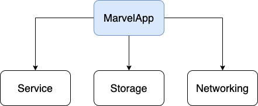
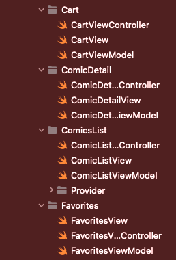
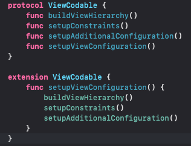
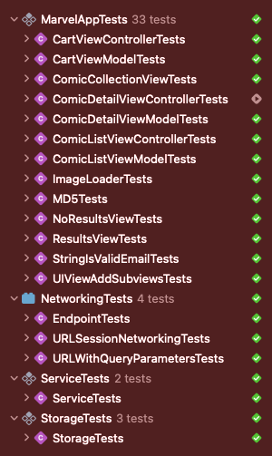

# MarvelApp

MarvelApp é um aplicativo iOS desenvolvido com Swift

[Preview](https://youtube.com/shorts/AYZsXuwpDww)

## Funcionalidades

### Mandatórias

* [x] Listagem Inicial das HQ's (com scroll infinito);
* [x] Buscar HQ pelo nome;
* [x] Filtro de ano para listagem;
* [x] Detalhes da HQ contendo título, imagem de capa, issue, preços, botão para efetuar compra e botão de adicionar ao carrinho;
* [x] Tela de carrinho com HQ's salvas no carrinho e botão de continuar a compra;
* [x] SwiftLint.

### Bônus

* [x] Tela de Login;
* [x] Favoritar/desfavoritar e tela de favoritos;
* [x] Arquitetura MVVM;
* [x] Pipeline;
* [x] Utilização de ViewCode para desenvolvimento do layout.

## Estrutura

Com o intuito de estuturar este aplicativo para ser escalável, foram criados um **workspace** com 4 projetos, cada um gerenciando uma preocupação específica de toda a aplicação.

* `MarvelApp`: Módulo principal do projeto. Contém todas as telas do aplicativo e também uma conexão com todos os outros módulos.
* `Service`: definir métodos usados ​​por outros módulos que tornam tarefas como persistência e *networking* desacopladas;
* `Storage`: abstrai a persistência dos dados expondo uma interface que permite, por exemplo, criar um banco de dados em memória;
* `Networking`: abstrai como a funcionalidade de *networking*, expondo uma interface genérica para fazer requisições.

## Arquitetura

O MVVM foi a arquitetura escolhida escolhido para evitar *ViewControllers* grandes e com múltiplas responsabilidade. 

## Construção do Layout

Para o desenvolvimento da interface do projeto foi escolhido o UIKit utilizando a abordagem de ViewCode. O ViewCode foi escolhido pois:

Permite melhor reuzo e componentização;
Permite melhor controle sobre o fluxo de inicialização.

## Testes Unitários e Testes de Snapshot

Até o momento foram criados 42 testes automatizados (testes unitários e testes de snapshot) para este projeto:

* `MarvelApp`: 33 Testes;
* `Networking`: 4 Testes;
* `Service`: 2 Testes;
* `Storage`: 3 Testes

## Pipeline

Foi configurado um pipeline de Integração Contínua CI para este projeto utilizando o [Github Actions](https://github.com/luis-gustavo/MarvelApp/actions), com o intuito de evitar a regressão de código. O status atual é:

## Gerenciador de Dependências

O Swift Package Manager foi utilizado para gerenciar as dependências do projeto, permitindo reutilização de código. Este projeto têm duas dependências essenciais:

* [SnapshotTesting](https://github.com/pointfreeco/swift-snapshot-testing): Framework utilizada para realizar os testes de snapshot;
* [SQLite](https://github.com/stephencelis/SQLite.swift): Utilizado para persistência local dos dados de favoritos e carrinho.

## Como Rodar

Para rodar o projeto é necessário adicionar três valores no arquivo *Info.plist*:

* `BASE_URL`: A URL base usado para fazer requisições ao servidor. O valor atual é: *https://gateway.marvel.com/v1/public*;
* `PUBLIC_KEY` e `PRIVATE_KEY`: As chaves necessárias para consumir os dados da API. Para conseguir basta seguir as intruções no [link](https://developer.marvel.com/documentation/authorization);
* Não existe uma autenticação "real" na tela de login, basta digitar um email válido e uma senha qualquer.